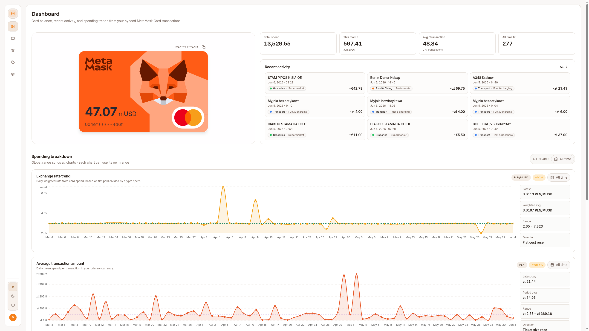
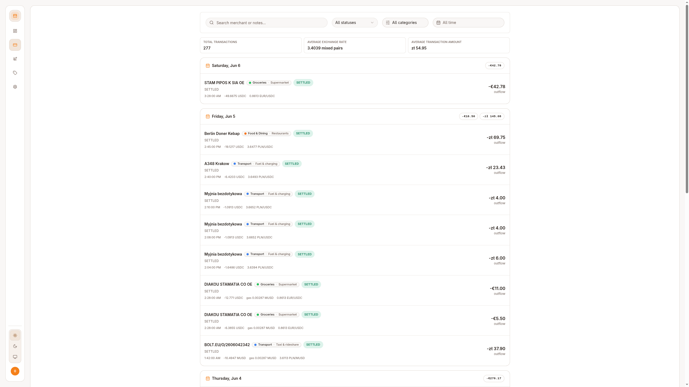
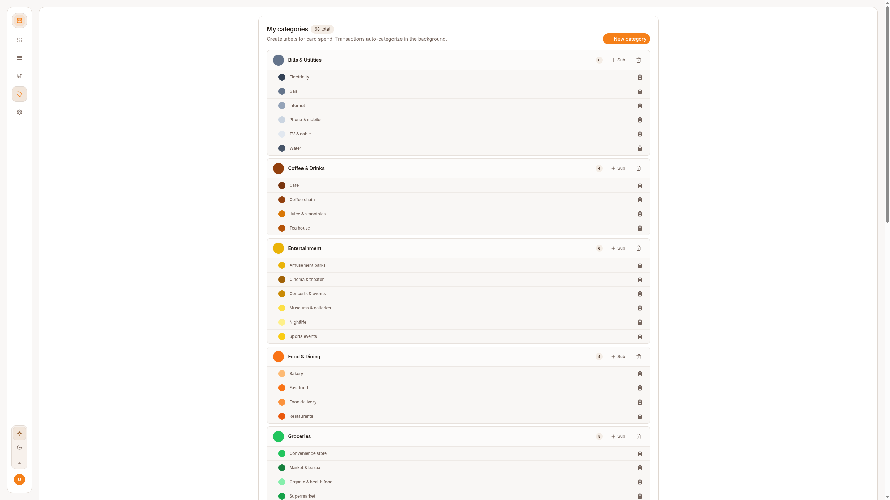
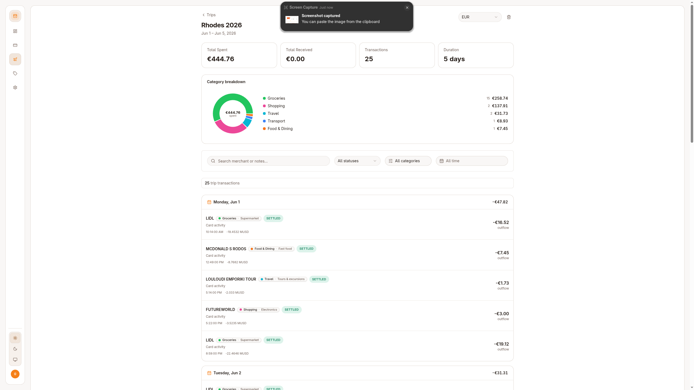
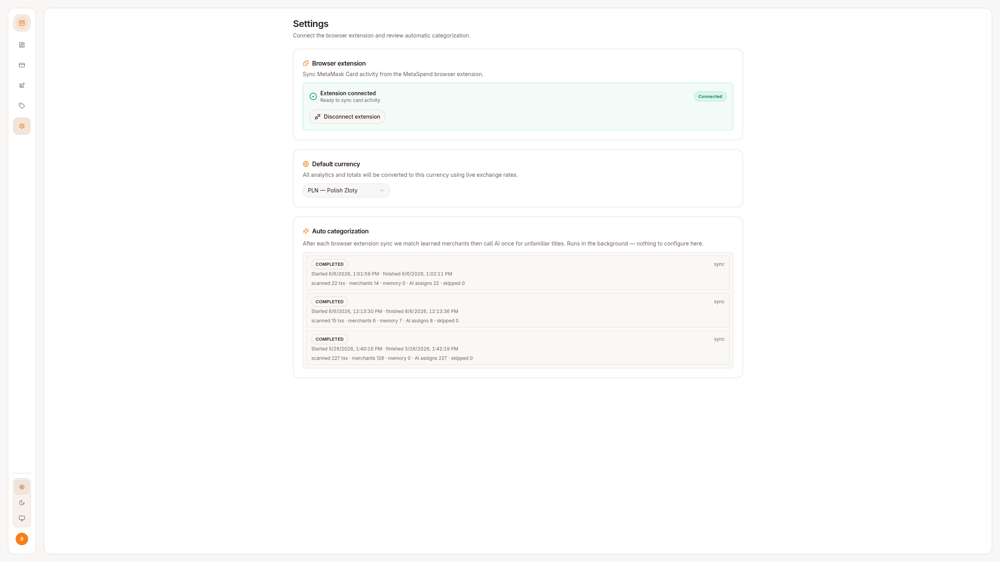

<p align="center"></p>

<h1 align="center">MetaSpend</h1>

<p align="center">
  Turns MetaMask Card transactions into a normal expense-tracking experience — categories,
  analytics, multi-currency trips — synced straight from the Card portal via a small browser
  extension. No private keys, no seed phrases, read-only sync only.
</p>

<p align="center">
  
  
  
  
  
  
</p>



## Features

- **Transaction history** — every Card spend, searchable and filterable.
- **Smart categories** — AI auto-categorization with merchant-rule and manual overrides.
- **Spending analytics** — daily/weekly/monthly trends and category breakdowns.
- **Trip tracking** — bucket spending by trip, across multiple currencies.
- **Real-time sync** — a Chrome extension syncs new Card transactions automatically.
- **Light & dark mode** — across the whole app.

## Screenshots

| Dashboard | Transactions |
|---|---|
|  |  |

| Categories | Trips |
|---|---|
|  |  |

| Settings |
|---|
|  |

## Monorepo layout

pnpm workspaces + Turborepo.

- `apps/api` — NestJS (Fastify adapter) REST API.
- `apps/web` — Next.js 15 dashboard.
- `apps/extension` — Plasmo Chrome extension that scrapes the MetaMask Card portal and syncs to the API.
- `packages/db` — Prisma schema/client.
- `packages/shared` — zod schemas, shared types, and merchant-categorization rules.

See [`CLAUDE.md`](CLAUDE.md) for the full architecture breakdown (auth flows, categorization
pipeline, data model, etc.) and [`docs/deployment-guide.md`](docs/deployment-guide.md) for a
step-by-step VPS deployment walkthrough.

## Getting started

```bash
pnpm install
cp .env.example .env
cp apps/api/.env.example apps/api/.env
cp apps/web/.env.local.example apps/web/.env.local

pnpm db:migrate
pnpm dev
```

- Web app: http://localhost:4000
- API: http://localhost:3001/api/v1

## Common commands

```bash
pnpm build                                   # turbo run build
pnpm lint                                    # turbo run lint
pnpm typecheck                                # turbo run typecheck
pnpm --filter @crypto-tracker/api test       # run API test suite

pnpm db:studio                               # browse the database
pnpm db:seed                                  # seed system categories
```
